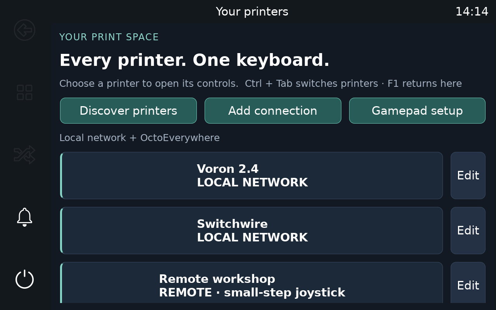

# KlipperController

A touchscreen control station for a Raspberry Pi 400: KlipperScreen’s printer controls, a simple multi-printer dashboard, local discovery, and a configurable HID gamepad.

**Initial release · hardware validation pending.** Automated checks cover motion interlocks and connection handling. The Pi 400, Waveshare panel, physical gamepad, real printers, and an authenticated OctoEverywhere connection still need an on-device test.



## Install

Start with **Raspberry Pi OS Lite 64-bit, Bookworm or newer**, on the Pi 400. Set up Wi-Fi/Ethernet and SSH in Raspberry Pi Imager. Connect your Waveshare display by HDMI and its touch connection by USB, plus its required power supply. The installer uses the display’s reported resolution; it does not assume a particular 10.1-inch model or overwrite display overlays.

Run as your normal Pi user:

```bash
sudo apt-get update && sudo apt-get install -y git
git clone https://github.com/maevebaksa/Klipper-Dashboard-Jogger.git
cd Klipper-Dashboard-Jogger
bash scripts/install.sh
```

The installer installs OS/Python dependencies, a private pinned KlipperScreen checkout, a Python environment, joystick device permissions, and a boot service. It does not install Klipper or Moonraker on the display Pi. It leaves your Wi-Fi configuration and printer configurations alone.

Lite is recommended. If another display manager or KlipperScreen service is running, the installer reports that conflict and does not stop it. Resolve the display-service conflict before starting this app. Standard HDMI/USB Waveshare displays should use the OS drivers; unusual display variants may need manufacturer setup first.

## Connect a printer

1. Tap **Discover printers**. Moonraker printers advertising `_moonraker._tcp` appear automatically.
2. If needed, tap **Scan local network**. This probes ports 7125 and 80 in up to two local /24 ranges. It does not search across VLANs or the Internet. Multiple Moonraker instances on other ports can be entered manually.
3. Select a result, give it a name, and tap **Test connection**. You can also use **Add connection**, e.g. `http://voron24.local:7125`.
4. If authentication is required, enter the printer’s **Moonraker API key**. Alternatively, add only the display Pi’s address to that printer’s existing Moonraker `trusted_clients` configuration.
5. **Save & reload** returns to the dashboard. Tap a printer card to open its KlipperScreen controls.

Supports mainline Klipper and RatOS through Moonraker. OctoPrint-only, Bambu and other non-Moonraker printers are not supported. Connecting through port 80 works only when that printer’s reverse proxy exposes Moonraker at that address.

### OctoEverywhere dual access

KlipperController supports OctoEverywhere **App Connections** as a fallback to a printer's normal LAN Moonraker URL. The local URL remains the primary connection; when it cannot be reached, KlipperController can use the saved App Connection instead.

1. Add or discover the printer using its local Moonraker URL and **Test connection**.
2. If the installed OctoEverywhere Klipper plugin publishes its public printer ID through Moonraker, KlipperController detects it automatically.
3. Enter the OctoEverywhere **App ID assigned to KlipperController**, then choose **Set up remote access**.
4. The OctoEverywhere authorization portal opens inside KlipperController with that printer preselected. Sign in and authorize the connection.
5. KlipperController captures the returned App Connection URL and authentication automatically. Save the printer connection.

OctoEverywhere's App Connection portal is intentionally user-authorized; an app cannot silently obtain a new remote URL from a local printer. The portal returns the remote URL and credentials only once, so KlipperController stores them in its owner-only profile file and redacts them from logs. OctoEverywhere currently requires Supporter Perks for App Connections.

An App ID is issued by OctoEverywhere to an integrating app. Until a KlipperController App ID has been assigned, the embedded setup flow cannot create a production App Connection. Legacy manually entered OctoEverywhere/custom remote URLs remain supported through **Primary URL is remote**.

Core Moonraker HTTP/WebSocket control uses the App Connection authentication. Remote webcam/media paths may require additional validation because every media request must also carry the App Connection authorization header.

## Keyboard and touchscreen

| Input | Action |
|---|---|
| Ctrl + Tab | Next saved printer |
| Ctrl + Shift + Tab | Previous saved printer |
| Alt + 1 … Alt + 9 | Select a saved printer by order |
| F1 | Printer dashboard |
| F2 | Move / jog screen |
| Escape | Disarm jogging and use KlipperScreen’s back/home behavior |
| Printer card / sidebar printer button | Select a printer / return to dashboard |

Connection fields also open KlipperScreen’s touchscreen keyboard. Standard KlipperScreen pages handle temperatures, files, print start/pause/resume/cancel, macros, fans, movement, and other printer features.

## Map a gamepad

Open **Gamepad setup** from the dashboard. USB HID gamepads supported by Linux/SDL are enumerated automatically; Bluetooth controllers must first be paired through the OS.

1. With one controller connected, optionally choose **Use this connected gamepad** to remember its model. **Allow any connected gamepad** clears this preference.
2. Tap **Learn hold-to-jog button**, then press a digital shoulder button. No enable button is assigned initially.
3. Choose a shortcut, tap **Learn shortcut button**, and press its button. The list includes **Jog X−/X+/Y−/Y+/Z−/Z+**, so an axis can be jogged with held digital buttons instead of an analog stick. Direction buttons still require the hold-to-jog button. To unassign, learn that button with **No action** selected.
4. Inspect the live axis values and select X, Y and Z axis numbers. Defaults are left-stick X/Y and right-stick Y (0/1/3), but SDL numbering varies. Invert each analog direction as needed; `−1` disables an analog axis, which is useful when that axis is controlled only by mapped jog buttons.
5. Adjust the deadzone if the sticks drift. Changes save immediately.

Available shortcuts: next/previous printer, dashboard, Move, Temperature, Macros, Files, pause, resume, cancel, home all axes, heaters off, emergency stop, and held Jog X/Y/Z directions. You can also learn a button for a **named custom G-code macro**. Resume, cancel, home, heaters-off, and custom macros require touchscreen/keyboard confirmation naming the selected printer. Emergency stop acts immediately on the selected printer. Hat/D-pad directions are still not treated as SDL buttons on every controller, so controllers that expose a D-pad only as a hat may need a later hat-mapping addition.

### Jogging behavior

- Home the printer and open **Move**. Gamepad jogging uses the **same move distance currently selected in KlipperScreen's Move panel**.
- The Move panel's configured **XY Speed** and **Z Speed** are the hard speed limits for gamepad jogging. Analog stick magnitude scales speed below that cap.
- When a local jog direction is held continuously, speed ramps from about **35% to 100% over 1.5 seconds**. Changing direction or centering the control restarts the ramp.
- Mapped Jog X/Y/Z buttons use the same selected step and speed ramp as an analog axis and still require the hold-to-jog button.
- Remote OctoEverywhere jogging remains deliberately discrete: one selected-size step is sent per deflection/held-direction event, and the direction must return to center/release before another remote step can be sent.
- Every move checks fresh Moonraker state. Printing, paused, unhomed, disconnected, or non-ready printers are blocked. Klipper enforces its kinematic limits.
- Only one request can be in flight; `M400` waits for the move to complete. The G-code mode and feed are restored with `SAVE_GCODE_STATE` / `RESTORE_GCODE_STATE MOVE=0`.
- Release, disconnect, focus loss, opening another page/dialog, or switching printers disarms motion. A fresh centered release/press sequence is required. No motion requests are automatically retried.
- Releasing stops **new** requests; a move already sent may finish, including after network delay. This is not a hardware dead-man switch. Avoid simultaneous jogging from another UI.
- Print-pause jogging, extrusion axes, stick-driven homing, and automatic tool changes are intentionally unavailable in this initial version.

## Update and troubleshoot

```bash
cd ~/Klipper-Dashboard-Jogger
bash scripts/update.sh
```

Updates preserve connections and mappings in `~/.config/klipper-dashboard-jogger/profiles.json`. The generated KlipperScreen config is rebuilt from that file; do not manually edit `generated.conf`.

```bash
systemctl status klipper-dashboard-jogger --no-pager
journalctl -u klipper-dashboard-jogger -b -n 100 --no-pager
sudo systemctl restart klipper-dashboard-jogger
```

If the controller is absent, unplug/replug it after installation, and check Linux recognizes it as a joystick. If touch or orientation is wrong before installation, correct the display setup in Raspberry Pi OS first. If discovery misses a printer, use its actual Moonraker URL and port; multicast may be blocked on your Wi-Fi.

Stop boot startup with `sudo systemctl disable --now klipper-dashboard-jogger`. The installer backs up an existing X wrapper configuration as `/etc/X11/Xwrapper.config.kdj-backup`; it does not delete your profiles on uninstall. Do not remove dependencies shared with other applications.

## Development and attribution

This is an extension of [KlipperScreen](https://github.com/KlipperScreen/KlipperScreen), not an independent reimplementation or an official KlipperScreen/OctoEverywhere product. Thank you to the KlipperScreen contributors. The upstream checkout is pinned in `klipperscreen.ref`, and its files are not modified. `launch.py` installs our window/transport adapter at runtime. The adapter includes a positional-argument compatibility fix for that pinned revision’s WebSocket construction and rejects callbacks from a previously selected printer.

Licensed under **AGPL-3.0**, matching the KlipperScreen base; see [LICENSE](LICENSE). Dependencies retain their respective licenses.

```bash
python3 -m venv --system-site-packages .venv
.venv/bin/pip install -r requirements.txt pytest
.venv/bin/python -m pytest -q
```

GTK packages are required to run the UI, but the core motion/network tests run without a display. See [validation notes](docs/VALIDATION.md) for the checks performed and remaining hardware checks.
