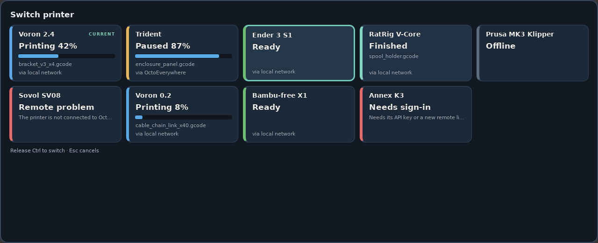
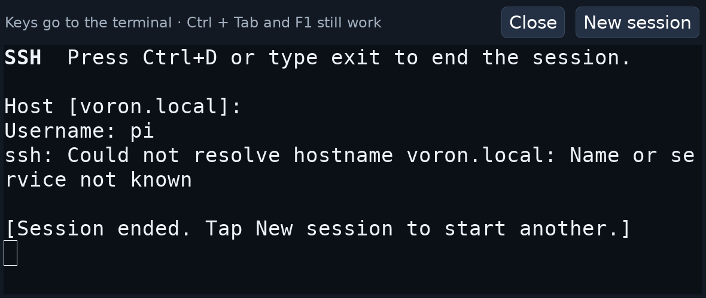
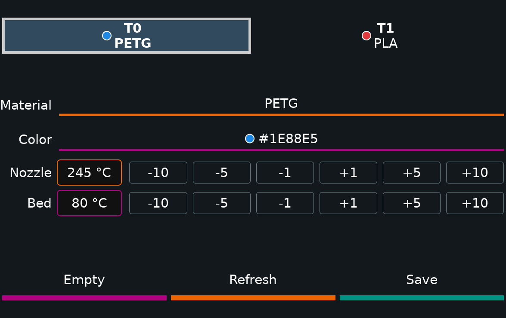

# KlipperController

A touchscreen control station for a Raspberry Pi 400: KlipperScreen’s printer controls, a simple multi-printer dashboard, local discovery, and a configurable HID gamepad.

**Initial release · hardware validation pending.** Automated checks cover motion interlocks and connection handling. The Pi 400, Waveshare panel, physical gamepad, real printers, and a real OctoEverywhere Shared Connection or App Connection still need an on-device test. See [the changelog](docs/CHANGELOG.md) for recent changes.


## Install

Start with **Raspberry Pi OS Lite 64-bit, Bookworm or newer**, on the Pi 400. Set up Wi-Fi/Ethernet and SSH in Raspberry Pi Imager. Connect your Waveshare display by HDMI and its touch connection by USB, plus its required power supply. The installer uses the display’s reported resolution; it does not assume a particular 10.1-inch model or overwrite display overlays.

Run as your normal Pi user:

```bash
sudo apt-get update && sudo apt-get install -y git
git clone https://github.com/maevebaksa/Klipper-Dashboard-Jogger.git
cd Klipper-Dashboard-Jogger
bash scripts/install.sh
```

The installer installs OS/Python dependencies, a private pinned KlipperScreen checkout, a Python environment, joystick device permissions, and a boot service. It does not install Klipper or Moonraker on the display Pi. It leaves your Wi-Fi configuration and printer configurations alone.

Lite is recommended. If another display manager or KlipperScreen service is running, the installer reports that conflict and does not stop it. Resolve the display-service conflict before starting this app. Standard HDMI/USB Waveshare displays should use the OS drivers; unusual display variants may need manufacturer setup first.

## Connect a printer

1. Tap **Manage**, then **Discover**. Moonraker printers advertising `_moonraker._tcp` appear automatically, already named (see below). Printers you have saved are marked **Already saved**.
2. If needed, tap **Scan local network**. This probes ports 7125 and 80 in up to two local /24 ranges. It does not search across VLANs or the Internet. Multiple Moonraker instances on other ports can be entered manually.
3. Tap a result. The connection editor opens and tests it straight away. You can also use **Add** and enter an address, e.g. `http://voron24.local:7125`, then **Test connection**.
4. If authentication is required, enter the printer's **Moonraker API key**. Alternatively, add only the display Pi's address to that printer's existing Moonraker `trusted_clients` configuration.
5. **Save & reload** returns to the dashboard. Tap a printer card to open its KlipperScreen controls.

Supports mainline Klipper and RatOS through Moonraker. OctoPrint-only, Bambu and other non-Moonraker printers are not supported. Connecting through port 80 works only when that printer's reverse proxy exposes Moonraker at that address.

### Printer names

KlipperController asks Moonraker for the name you already gave the printer, in this order:

1. The **Mainsail** printer name (Settings, General, Printer name), stored by Mainsail in Moonraker's database.
2. The **Fluidd** printer name (Settings, General, Printer name), stored by Fluidd in Moonraker's database. Fluidd's default name "Fluidd" is ignored.
3. The printer computer's **host name** as reported by Klipper (`/printer/info`), which needs Klipper to be running.

Discovery and **Test connection** fill in the name until you type your own. If you already typed one and the printer reports a different name, the editor offers **Use the printer's name** instead of overwriting yours. Characters that saved profile names cannot contain (such as `/` or emoji) are dropped.

When a printer answers on a numeric address and its `hostname.local` address also works, the saved URL uses the host name so a DHCP address change does not break it. The numeric address is kept as a LAN fallback for networks where `.local` names stop resolving.

### Dashboard

The dashboard is a quick glance at every printer: one tile each, with the state in large type (`Printing 42%`, `Paused`, `Ready`, `Offline`), a progress bar, the file name, and the route (`via local network` or `via OctoEverywhere`). The tile's colored edge shows the state at a distance: blue printing, amber paused, teal finished, green ready, red needs attention, gray offline. The printer you are connected to is marked **CURRENT**, and a line under the title sums up the fleet, e.g. `2 printing · 1 paused · 1 offline`. Tap a tile, or press the number shown on it (1 to 9), to open that printer's controls.

Everything else is behind **Manage** (top right): Discover, Add, Network, Gamepad, Update, and the list of saved printers with their **Edit** buttons. **SSH** sits next to it (see below).

The grid sizes itself to the space KlipperScreen leaves it, so at least nine printers fit on screen without scrolling on both 1280x800 and 1024x600 panels. KlipperScreen scales its font with the screen (about 30 px on 1280x800), so the dashboard measures how tall a tile's text really is before laying out the grid. With less room, tiles get shorter and drop the file-name line, then the route line; only much larger fleets scroll.

Status keeps refreshing in the background, even while you are inside a printer's controls, so the dashboard and the switcher are always current. Printers on the local network refresh every 15 seconds; printers reached through OctoEverywhere refresh every 60 seconds to keep relay traffic low. Press **Ctrl + R** on the dashboard to re-check every printer right away.

### Switching printers

Switching works like Alt + Tab. A panel of printer tiles appears over whatever screen is open, with the same live status as the dashboard:



- **Keyboard:** hold Ctrl and press Tab as many times as you like to step forward (Shift + Tab or the arrow keys step back). Release Ctrl to switch to the highlighted printer. Each tile shows a number: press **1** to **9** while the panel is open to jump straight to that printer. Escape cancels; Enter switches immediately.
- **Gamepad:** press the button mapped to **Next printer** or **Previous printer** to open the panel and step through. Stop pressing and it switches after about 1.5 seconds.
- **Touch:** tap any tile in the panel to switch to it straight away.

Pressing another shortcut closes the panel without switching. While Ctrl is held, the controller watches the Ctrl key itself rather than waiting for a key-release event, because without a window manager the popup can take the keyboard focus and the release would otherwise be lost.

### SSH terminal

With a keyboard connected, tap **SSH** on the dashboard for a terminal. It asks for the host (press Enter for the current printer's local address), then your user name, then ssh asks for the password. Every key goes to the terminal except **Ctrl + Tab** (switch printer) and **F1** (dashboard). **New session** starts over; leaving the panel with **Close** or F1 ends the session. Printers reached only through OctoEverywhere have no local address to offer, so type a host yourself.



The terminal needs the `gir1.2-vte-2.91` package, which the installer adds. If it is missing, the panel says so and offers **Finish setup**, which opens the Update screen to run the installer.

### OctoEverywhere remote access

KlipperController can use [OctoEverywhere](https://octoeverywhere.com) as a backup route to a printer's normal LAN Moonraker address. It switches automatically:

- **When you open a printer**, it checks the LAN address, the LAN fallback address and OctoEverywhere at the same time and uses the first working one in that order. A slow or failing `.local` lookup cannot hold things up for more than about 3 seconds.
- **When a connection drops**, it rechecks and rebuilds the connection on whichever route works.
- **While on OctoEverywhere**, it checks the LAN every 30 seconds and moves back once the printer answers locally. To avoid interrupting you, it only switches while the main menu or print status screen is showing and no jog is in progress.
- A popup names the route whenever a printer connects through OctoEverywhere or returns to the local network.
- **If a connection stalls** (no reply for 15 s on the local network, 30 s over OctoEverywhere) while a printer is starting up, it is rebuilt automatically, up to 3 times, after which the screen says the printer is not responding. A websocket keepalive also closes connections that die silently, for example after a Wi-Fi drop, so the reconnect logic above can run.

#### Link a printer (no typing on the touchscreen)

You need the OctoEverywhere plugin installed on the printer and an OctoEverywhere account. OctoEverywhere offers Shared Connections as a supporter perk.

1. Add or discover the printer with its local address and **Test connection**. If the OctoEverywhere plugin is installed, the editor says so.
2. Under **Remote access (OctoEverywhere)**, tap **Link using your phone**. The touchscreen shows a QR code.
3. Scan it with a phone on the **same network** as the controller. A small setup page opens.
4. Tap **Open OctoEverywhere Shared Connections**, sign in, and create or copy the Shared Connection for this printer.
5. Go back to the setup page, paste the link, and tap **Link remote access**. If your shared connection has a username and password, open the section below the link box and enter them.

KlipperController then checks that the link works and that it reaches the **same printer**, by comparing the OctoEverywhere printer ID (or, failing that, the Klipper host name) seen through the link with the one on the LAN. It saves the link immediately; the phone and touchscreen both confirm. Remove it any time with **Remove remote access** followed by **Save & reload**.

The setup page is served by the controller itself for up to 15 minutes, only while the QR screen is open, only to devices on private network addresses, at an unguessable one-time path. It sends no-referrer and no-store headers so the path does not leak. Because it is plain HTTP on your LAN, only use it on a network you trust.

#### App Connections (App ID holders)

OctoEverywhere's [App Connection portal](https://docs.octoeverywhere.com/app-connections/portal/) needs an App ID that OctoEverywhere assigns to an integrating app. If you have one, enter it under **Advanced** in the connection editor. **Link using your phone** then sends the phone through the portal, which returns to the controller with the App Connection URL and credentials. Leave the App ID empty to use Shared Connections.

The portal previously ran in a browser embedded in the touchscreen. That browser could not use KlipperScreen's on-screen keyboard to sign in and could take the app down while closing, so it was replaced by the phone flow.

#### Remote access details

- Linked credentials are stored in the owner-only profile file and redacted from logs, including links made after startup.
- OctoEverywhere status codes become plain messages, e.g. "The printer is not connected to OctoEverywhere right now" (601) or "needs Supporter Perks" (605).
- Core Moonraker HTTP/WebSocket control carries the link's authorization. KlipperScreen's thumbnail and webcam requests do not, so those may be missing while remote.
- Remote jogging stays deliberately discrete (see Jogging behavior).
- Legacy profiles whose primary URL is itself remote still work; that option is now under **Advanced** as **Primary URL is itself remote (legacy)**.

### Klipper Filament Sync

KlipperController integrates [Klipper Filament Sync](https://github.com/maevebaksa/Klipper-Filament-Sync), which stores each tool's material, color and temperatures on the printer (`SET_TOOL_FILAMENT`) and mirrors them into Moonraker's `lane_data`. Install the plugin on each printer as its README describes; nothing extra is needed on the controller.

- **Dashboard:** each printer's tiles show one color dot per tool (up to four) next to its name, and the materials next to the route line, e.g. `PLA`, `ASA · Empty` or `3/4 loaded`. The dots stay visible even when tiles are too short for the lower lines.
- **Tool Filaments** appears in a printer's main menu when that printer has the `SET_TOOL_FILAMENT` macro. It is the plugin's own KlipperScreen panel, run unmodified: pick a tool, set material, color and temperatures, and **Save**.
- **Gamepad:** map a button to **Tool filaments (Filament Sync)** to open it.

The installer downloads the panel from the plugin's repository at the commit pinned in `filament-sync.ref` (like `klipperscreen.ref`), into `~/.local/share/klipper-dashboard-jogger/Klipper-Filament-Sync`. To use a newer panel, update that ref. If the download is missing, the Tool Filaments button explains how to run the installer.



## Keyboard and touchscreen

| Input | Action |
|---|---|
| Hold Ctrl, press Tab | Open the printer switcher and step forward; release Ctrl to switch |
| Hold Ctrl, press Shift + Tab | Step backward in the switcher |
| 1 to 9 (switcher open) | Switch straight to that numbered printer |
| Arrow keys / Enter / Escape (switcher open) | Step / switch now / cancel |
| 1 to 9 (dashboard) | Open that numbered printer |
| Ctrl + R (dashboard) | Re-check every printer now |
| Alt + 1 … Alt + 9 | Select a saved printer by order |
| F1 | Printer dashboard |
| F2 | Move / jog screen |
| Escape | Disarm jogging and use KlipperScreen’s back/home behavior |
| Printer tile / sidebar printer button | Select a printer / return to dashboard |

Connection fields also open KlipperScreen’s touchscreen keyboard. Standard KlipperScreen pages handle temperatures, files, print start/pause/resume/cancel, macros, fans, movement, and other printer features.

## Map a gamepad

Open **Manage**, then **Gamepad**. USB HID gamepads supported by Linux/SDL are enumerated automatically; Bluetooth controllers must first be paired through the OS.

1. With one controller connected, optionally choose **Use this connected gamepad** to remember its model. **Allow any connected gamepad** clears this preference.
2. Tap **Learn hold-to-jog button**, then press a digital shoulder button. No enable button is assigned initially.
3. Choose a shortcut, tap **Learn shortcut button**, and press its button. The list includes **Jog X−/X+/Y−/Y+/Z−/Z+**, so an axis can be jogged with held digital buttons instead of an analog stick. Direction buttons still require the hold-to-jog button. To unassign, learn that button with **No action** selected.
4. Inspect the live axis values and select X, Y and Z axis numbers. Defaults are left-stick X/Y and right-stick Y (0/1/3), but SDL numbering varies. Invert each analog direction as needed; `−1` disables an analog axis, which is useful when that axis is controlled only by mapped jog buttons.
5. Adjust the deadzone if the sticks drift. Changes save immediately.

Available shortcuts: next/previous printer, dashboard, Move, Temperature, Macros, Files, pause, resume, cancel, home all axes, heaters off, emergency stop, and held Jog X/Y/Z directions. You can also learn a button for a **named custom G-code macro**. Resume, cancel, home, heaters-off, and custom macros require touchscreen/keyboard confirmation naming the selected printer. Emergency stop acts immediately on the selected printer. Hat/D-pad directions are still not treated as SDL buttons on every controller, so controllers that expose a D-pad only as a hat may need a later hat-mapping addition.

### Jogging behavior

- Home the printer and open **Move**. Gamepad jogging uses the **same move distance currently selected in KlipperScreen's Move panel**.
- The Move panel's configured **XY Speed** and **Z Speed** are the hard speed limits for gamepad jogging. Analog stick magnitude scales speed below that cap.
- When a local jog direction is held continuously, speed ramps from about **35% to 100% over 1.5 seconds**. Changing direction or centering the control restarts the ramp.
- Mapped Jog X/Y/Z buttons use the same selected step and speed ramp as an analog axis and still require the hold-to-jog button.
- Remote OctoEverywhere jogging remains deliberately discrete: one selected-size step is sent per deflection/held-direction event, and the direction must return to center/release before another remote step can be sent.
- Every move checks fresh Moonraker state. Printing, paused, unhomed, disconnected, or non-ready printers are blocked. Klipper enforces its kinematic limits.
- Only one request can be in flight; `M400` waits for the move to complete. The G-code mode and feed are restored with `SAVE_GCODE_STATE` / `RESTORE_GCODE_STATE MOVE=0`.
- Release, disconnect, focus loss, opening another page/dialog, or switching printers disarms motion. A fresh centered release/press sequence is required. No motion requests are automatically retried.
- Releasing stops **new** requests; a move already sent may finish, including after network delay. This is not a hardware dead-man switch. Avoid simultaneous jogging from another UI.
- Print-pause jogging, extrusion axes, stick-driven homing, and automatic tool changes are intentionally unavailable in this initial version.

## Update and troubleshoot

### From the touchscreen

Tap **Manage**, then **Update**. KlipperController checks GitHub, lists what is new, and shows whether system setup is complete. A copy with local edits or local commits is never updated from the touchscreen, so your changes are never overwritten. Either action restarts the app when done; prints keep running on the printers, and jogging stops during the restart.

With passwordless sudo (the Raspberry Pi OS default for the first user; the screen checks with `sudo -n true`) there are two buttons:

- **Update** (when something is new): runs `scripts/update.sh`, exactly what an SSH update runs: `git pull`, then the installer.
- **Run installer** (always): runs `scripts/install.sh` alone, without pulling. Use it to finish or repair system setup, for example when the SSH terminal says it is not installed.

Both run as your user in a temporary systemd unit named `kdj-update`, so the installer restarting the app at the end does not interrupt them. Their output goes to `~/.local/share/klipper-dashboard-jogger/last-update.log`. When there is no terminal, as here, the installer tells apt and dpkg not to stop for questions and to keep existing config files.

**System setup needs to finish.** The installer records a fingerprint of itself when it completes. If there is none, the installer has never completed since this tracking was added, or its last run failed. If it differs, the installer has changed since it last ran. Either way the screen says so and shows the last lines of `last-update.log`, so a failure is visible on the touchscreen. If a run stops without restarting the app, the screen says so, shows the same log lines, and offers **Run installer** again. The full log is also available with:

```bash
journalctl -u kdj-update -b --no-pager
```

**Limited update (sudo needs a password).** The button cannot answer a password prompt, so **Update** only fast-forwards the checkout, moves the managed KlipperScreen checkout if `klipperscreen.ref` changed, reinstalls Python packages into the app's own venv if `requirements.txt` changed, and restarts the app. System setup then has to be finished over SSH with `scripts/update.sh`; the screen says when.

The Update screen never grants itself new permissions: it uses sudo only when sudo already works without a password.

### Over SSH

```bash
cd ~/Klipper-Dashboard-Jogger
bash scripts/update.sh
```

This pulls the latest version and reruns the installer (it asks for your password for the system steps). Use it for the first update to a version that has the **Update** button, and whenever the touchscreen asks you to.

Updates preserve connections and mappings in `~/.config/klipper-dashboard-jogger/profiles.json`. The generated KlipperScreen config is rebuilt from that file; do not manually edit `generated.conf`.

```bash
systemctl status klipper-dashboard-jogger --no-pager
journalctl -u klipper-dashboard-jogger -b -n 100 --no-pager
sudo systemctl restart klipper-dashboard-jogger
```

If the controller is absent, unplug/replug it after installation, and check Linux recognizes it as a joystick. If touch or orientation is wrong before installation, correct the display setup in Raspberry Pi OS first. If discovery misses a printer, use its actual Moonraker URL and port; multicast may be blocked on your Wi-Fi.

Stop boot startup with `sudo systemctl disable --now klipper-dashboard-jogger`. The installer backs up an existing X wrapper configuration as `/etc/X11/Xwrapper.config.kdj-backup`; it does not delete your profiles on uninstall. Do not remove dependencies shared with other applications.

## Development and attribution

This is an extension of [KlipperScreen](https://github.com/KlipperScreen/KlipperScreen), not an independent reimplementation or an official KlipperScreen/OctoEverywhere product. Thank you to the KlipperScreen contributors. The upstream checkout is pinned in `klipperscreen.ref`, and its files are not modified. `launch.py` installs our window/transport adapter at runtime. The adapter includes a positional-argument compatibility fix for that pinned revision’s WebSocket construction and rejects callbacks from a previously selected printer.

Licensed under **AGPL-3.0**, matching the KlipperScreen base; see [LICENSE](LICENSE). Dependencies retain their respective licenses.

```bash
python3 -m venv --system-site-packages .venv
.venv/bin/pip install -r requirements.txt pytest
.venv/bin/python -m pytest -q
```

GTK packages are required to run the UI, but the core motion/network tests run without a display. See [validation notes](docs/VALIDATION.md) for the checks performed and remaining hardware checks.
