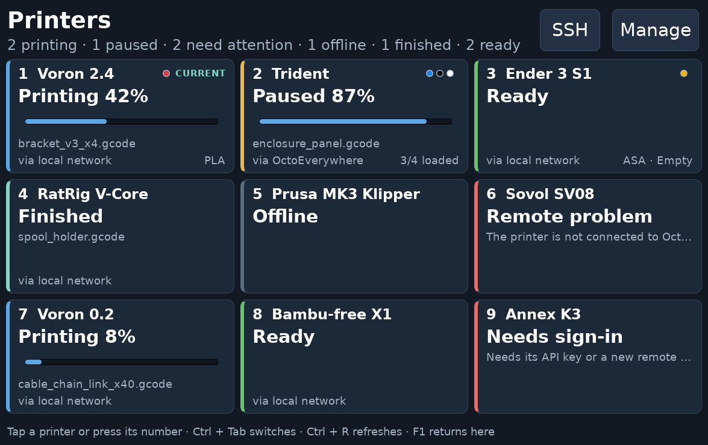

# KlipperController

A touchscreen control station for a Raspberry Pi 400: KlipperScreen’s printer controls, a simple multi-printer dashboard, local discovery, and a configurable HID gamepad.

**Initial release · hardware validation pending.** Automated checks cover motion interlocks and connection handling. The Pi 400, Waveshare panel, physical gamepad, real printers, and a real OctoEverywhere Shared Connection or App Connection still need an on-device test. See [the changelog](docs/CHANGELOG.md) for recent changes.



## Install

Start with **Raspberry Pi OS Lite 64-bit, Bookworm or newer**, on the Pi 400. Set up Wi-Fi/Ethernet and SSH in Raspberry Pi Imager. Connect your Waveshare display by HDMI and its touch connection by USB, plus its required power supply. The installer uses the display’s reported resolution; it does not assume a particular 10.1-inch model or overwrite display overlays.

Run as your normal Pi user:

```bash
sudo apt-get update && sudo apt-get install -y git
git clone https://github.com/maevebaksa/Klipper-Dashboard-Jogger.git
cd Klipper-Dashboard-Jogger
bash scripts/install.sh
```

The installer installs OS/Python dependencies, a private pinned KlipperScreen checkout, a Python environment, joystick device permissions, and a boot service. It does not install Klipper or Moonraker on the display Pi. It leaves your Wi-Fi configuration and printer configurations alone.

Lite is recommended. If another display manager or KlipperScreen service is running, the installer reports that conflict and does not stop it. Resolve the display-service conflict before starting this app. Standard HDMI/USB Waveshare displays should use the OS drivers; unusual display variants may need manufacturer setup first.

## Connect a printer

1. Tap **Discover printers**. Moonraker printers advertising `_moonraker._tcp` appear automatically, already named (see below). Printers you have saved are marked **Already saved**.
2. If needed, tap **Scan local network**. This probes ports 7125 and 80 in up to two local /24 ranges. It does not search across VLANs or the Internet. Multiple Moonraker instances on other ports can be entered manually.
3. Tap a result. The connection editor opens and tests it straight away. You can also use **Add** and enter an address, e.g. `http://voron24.local:7125`, then **Test connection**.
4. If authentication is required, enter the printer's **Moonraker API key**. Alternatively, add only the display Pi's address to that printer's existing Moonraker `trusted_clients` configuration.
5. **Save & reload** returns to the dashboard. Tap a printer card to open its KlipperScreen controls.

Supports mainline Klipper and RatOS through Moonraker. OctoPrint-only, Bambu and other non-Moonraker printers are not supported. Connecting through port 80 works only when that printer's reverse proxy exposes Moonraker at that address.

### Printer names

KlipperController asks Moonraker for the name you already gave the printer, in this order:

1. The **Mainsail** printer name (Settings, General, Printer name), stored by Mainsail in Moonraker's database.
2. The **Fluidd** printer name (Settings, General, Printer name), stored by Fluidd in Moonraker's database. Fluidd's default name "Fluidd" is ignored.
3. The printer computer's **host name** as reported by Klipper (`/printer/info`), which needs Klipper to be running.

Discovery and **Test connection** fill in the name until you type your own. If you already typed one and the printer reports a different name, the editor offers **Use the printer's name** instead of overwriting yours. Characters that saved profile names cannot contain (such as `/` or emoji) are dropped.

When a printer answers on a numeric address and its `hostname.local` address also works, the saved URL uses the host name so a DHCP address change does not break it. The numeric address is kept as a LAN fallback for networks where `.local` names stop resolving.

### Dashboard status

Each printer card shows live state and route, e.g. `Printing 42% · local network`, `Ready · OctoEverywhere` or `Offline`. Printers on the local network refresh every 15 seconds while the dashboard is open; printers reached through OctoEverywhere refresh every 60 seconds to keep relay traffic low.

### OctoEverywhere remote access

KlipperController can use [OctoEverywhere](https://octoeverywhere.com) as a backup route to a printer's normal LAN Moonraker address. It switches automatically:

- **When you open a printer**, it checks the LAN address, the LAN fallback address and OctoEverywhere at the same time and uses the first working one in that order. A slow or failing `.local` lookup cannot hold things up for more than about 3 seconds.
- **When a connection drops**, it rechecks and rebuilds the connection on whichever route works.
- **While on OctoEverywhere**, it checks the LAN every 30 seconds and moves back once the printer answers locally. To avoid interrupting you, it only switches while the main menu or print status screen is showing and no jog is in progress.
- A popup names the route whenever a printer connects through OctoEverywhere or returns to the local network.

#### Link a printer (no typing on the touchscreen)

You need the OctoEverywhere plugin installed on the printer and an OctoEverywhere account. OctoEverywhere offers Shared Connections as a supporter perk.

1. Add or discover the printer with its local address and **Test connection**. If the OctoEverywhere plugin is installed, the editor says so.
2. Under **Remote access (OctoEverywhere)**, tap **Link using your phone**. The touchscreen shows a QR code.
3. Scan it with a phone on the **same network** as the controller. A small setup page opens.
4. Tap **Open OctoEverywhere Shared Connections**, sign in, and create or copy the Shared Connection for this printer.
5. Go back to the setup page, paste the link, and tap **Link remote access**. If your shared connection has a username and password, open the section below the link box and enter them.

KlipperController then checks that the link works and that it reaches the **same printer**, by comparing the OctoEverywhere printer ID (or, failing that, the Klipper host name) seen through the link with the one on the LAN. It saves the link immediately; the phone and touchscreen both confirm. Remove it any time with **Remove remote access** followed by **Save & reload**.

The setup page is served by the controller itself for up to 15 minutes, only while the QR screen is open, only to devices on private network addresses, at an unguessable one-time path. It sends no-referrer and no-store headers so the path does not leak. Because it is plain HTTP on your LAN, only use it on a network you trust.

#### App Connections (App ID holders)

OctoEverywhere's [App Connection portal](https://docs.octoeverywhere.com/app-connections/portal/) needs an App ID that OctoEverywhere assigns to an integrating app. If you have one, enter it under **Advanced** in the connection editor. **Link using your phone** then sends the phone through the portal, which returns to the controller with the App Connection URL and credentials. Leave the App ID empty to use Shared Connections.

The portal previously ran in a browser embedded in the touchscreen. That browser could not use KlipperScreen's on-screen keyboard to sign in and could take the app down while closing, so it was replaced by the phone flow.

#### Remote access details

- Linked credentials are stored in the owner-only profile file and redacted from logs, including links made after startup.
- OctoEverywhere status codes become plain messages, e.g. "The printer is not connected to OctoEverywhere right now" (601) or "needs Supporter Perks" (605).
- Core Moonraker HTTP/WebSocket control carries the link's authorization. KlipperScreen's thumbnail and webcam requests do not, so those may be missing while remote.
- Remote jogging stays deliberately discrete (see Jogging behavior).
- Legacy profiles whose primary URL is itself remote still work; that option is now under **Advanced** as **Primary URL is itself remote (legacy)**.

## Keyboard and touchscreen

| Input | Action |
|---|---|
| Ctrl + Tab | Next saved printer |
| Ctrl + Shift + Tab | Previous saved printer |
| Alt + 1 … Alt + 9 | Select a saved printer by order |
| F1 | Printer dashboard |
| F2 | Move / jog screen |
| Escape | Disarm jogging and use KlipperScreen’s back/home behavior |
| Printer card / sidebar printer button | Select a printer / return to dashboard |

Connection fields also open KlipperScreen’s touchscreen keyboard. Standard KlipperScreen pages handle temperatures, files, print start/pause/resume/cancel, macros, fans, movement, and other printer features.

## Map a gamepad

Open **Gamepad setup** from the dashboard. USB HID gamepads supported by Linux/SDL are enumerated automatically; Bluetooth controllers must first be paired through the OS.

1. With one controller connected, optionally choose **Use this connected gamepad** to remember its model. **Allow any connected gamepad** clears this preference.
2. Tap **Learn hold-to-jog button**, then press a digital shoulder button. No enable button is assigned initially.
3. Choose a shortcut, tap **Learn shortcut button**, and press its button. The list includes **Jog X−/X+/Y−/Y+/Z−/Z+**, so an axis can be jogged with held digital buttons instead of an analog stick. Direction buttons still require the hold-to-jog button. To unassign, learn that button with **No action** selected.
4. Inspect the live axis values and select X, Y and Z axis numbers. Defaults are left-stick X/Y and right-stick Y (0/1/3), but SDL numbering varies. Invert each analog direction as needed; `−1` disables an analog axis, which is useful when that axis is controlled only by mapped jog buttons.
5. Adjust the deadzone if the sticks drift. Changes save immediately.

Available shortcuts: next/previous printer, dashboard, Move, Temperature, Macros, Files, pause, resume, cancel, home all axes, heaters off, emergency stop, and held Jog X/Y/Z directions. You can also learn a button for a **named custom G-code macro**. Resume, cancel, home, heaters-off, and custom macros require touchscreen/keyboard confirmation naming the selected printer. Emergency stop acts immediately on the selected printer. Hat/D-pad directions are still not treated as SDL buttons on every controller, so controllers that expose a D-pad only as a hat may need a later hat-mapping addition.

### Jogging behavior

- Home the printer and open **Move**. Gamepad jogging uses the **same move distance currently selected in KlipperScreen's Move panel**.
- The Move panel's configured **XY Speed** and **Z Speed** are the hard speed limits for gamepad jogging. Analog stick magnitude scales speed below that cap.
- When a local jog direction is held continuously, speed ramps from about **35% to 100% over 1.5 seconds**. Changing direction or centering the control restarts the ramp.
- Mapped Jog X/Y/Z buttons use the same selected step and speed ramp as an analog axis and still require the hold-to-jog button.
- Remote OctoEverywhere jogging remains deliberately discrete: one selected-size step is sent per deflection/held-direction event, and the direction must return to center/release before another remote step can be sent.
- Every move checks fresh Moonraker state. Printing, paused, unhomed, disconnected, or non-ready printers are blocked. Klipper enforces its kinematic limits.
- Only one request can be in flight; `M400` waits for the move to complete. The G-code mode and feed are restored with `SAVE_GCODE_STATE` / `RESTORE_GCODE_STATE MOVE=0`.
- Release, disconnect, focus loss, opening another page/dialog, or switching printers disarms motion. A fresh centered release/press sequence is required. No motion requests are automatically retried.
- Releasing stops **new** requests; a move already sent may finish, including after network delay. This is not a hardware dead-man switch. Avoid simultaneous jogging from another UI.
- Print-pause jogging, extrusion axes, stick-driven homing, and automatic tool changes are intentionally unavailable in this initial version.

## Update and troubleshoot

### From the touchscreen

Tap **Update** on the dashboard. KlipperController checks GitHub and lists what is new. **Install and restart** then:

1. fast-forwards this checkout (`git merge --ff-only`),
2. moves the managed KlipperScreen checkout if `klipperscreen.ref` changed,
3. reinstalls Python packages into the app's own venv if `requirements.txt` changed,
4. restarts the app. Prints keep running on the printers; jogging stops during the restart.

The touchscreen update never uses sudo, so it cannot change system packages, device permissions or the boot service. When an update changes the installer, the update screen says so; finish it over SSH with `scripts/update.sh`. The button also refuses to update a checkout with local edits or local commits, so your changes are never overwritten.

### Over SSH

```bash
cd ~/Klipper-Dashboard-Jogger
bash scripts/update.sh
```

This pulls the latest version and reruns the installer (it asks for your password for the system steps). Use it for the first update to a version that has the **Update** button, and whenever the touchscreen asks you to.

Updates preserve connections and mappings in `~/.config/klipper-dashboard-jogger/profiles.json`. The generated KlipperScreen config is rebuilt from that file; do not manually edit `generated.conf`.

```bash
systemctl status klipper-dashboard-jogger --no-pager
journalctl -u klipper-dashboard-jogger -b -n 100 --no-pager
sudo systemctl restart klipper-dashboard-jogger
```

If the controller is absent, unplug/replug it after installation, and check Linux recognizes it as a joystick. If touch or orientation is wrong before installation, correct the display setup in Raspberry Pi OS first. If discovery misses a printer, use its actual Moonraker URL and port; multicast may be blocked on your Wi-Fi.

Stop boot startup with `sudo systemctl disable --now klipper-dashboard-jogger`. The installer backs up an existing X wrapper configuration as `/etc/X11/Xwrapper.config.kdj-backup`; it does not delete your profiles on uninstall. Do not remove dependencies shared with other applications.

## Development and attribution

This is an extension of [KlipperScreen](https://github.com/KlipperScreen/KlipperScreen), not an independent reimplementation or an official KlipperScreen/OctoEverywhere product. Thank you to the KlipperScreen contributors. The upstream checkout is pinned in `klipperscreen.ref`, and its files are not modified. `launch.py` installs our window/transport adapter at runtime. The adapter includes a positional-argument compatibility fix for that pinned revision’s WebSocket construction and rejects callbacks from a previously selected printer.

Licensed under **AGPL-3.0**, matching the KlipperScreen base; see [LICENSE](LICENSE). Dependencies retain their respective licenses.

```bash
python3 -m venv --system-site-packages .venv
.venv/bin/pip install -r requirements.txt pytest
.venv/bin/python -m pytest -q
```

GTK packages are required to run the UI, but the core motion/network tests run without a display. See [validation notes](docs/VALIDATION.md) for the checks performed and remaining hardware checks.
